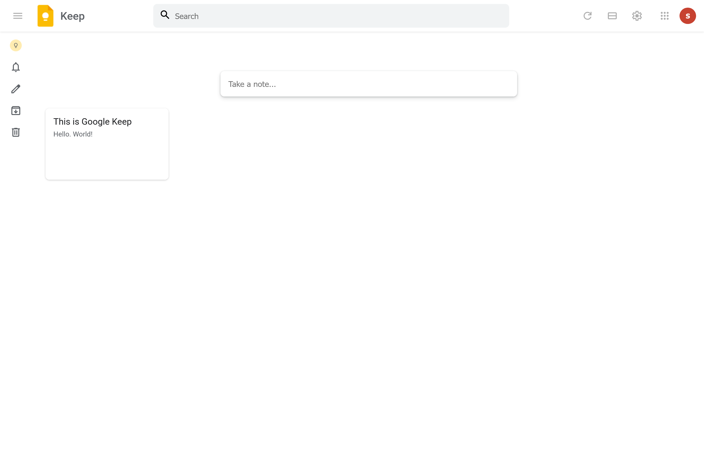

# Google Keep–Style Notes App

A simple Google Keep–inspired notes app built with **HTML, CSS, and JavaScript**.  
You can create, view, and archive notes directly in the browser.


## Getting Started
### 1. Clone the repository
```bash
git clone https://github.com/simplyyliam/Google-keep-clone
